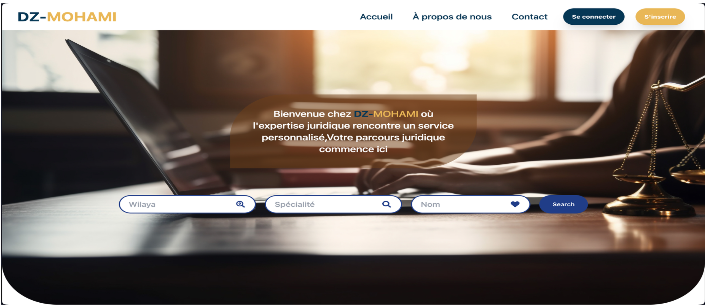

# DZ-Mouhami: Web Directory for Lawyers in Algeria

## 🌟 Project Description

In the current era of digital transformation, the way we access information and services has undergone a radical change. **DZ-Mouhami** is an innovative web directory tailored specifically for lawyers in Algeria. This project aims to bridge the gap between legal professionals and their clients, fostering seamless interaction and accessibility.

DZ-Mouhami leverages advanced technology to redefine the legal landscape, offering a platform that promotes virtual connectivity and accessibility. With features designed to optimize the search for lawyers and facilitate client-lawyer interactions, this initiative is poised to become a cornerstone in Algeria's legal ecosystem.

---

## 📂 Project Structure

The project is documented in four key chapters:
1. **Chapter 01**: Needs Specification  
2. **Chapter 02**: Project Design  
3. **Chapter 03**: Project Implementation  
4. **Chapter 04**: General Conclusion  

---
## 📄 Project Resources
- [📘 Full Project Report (PDF)](./GL_Project.pdf)
###
  **Note:** The project report is too large to be rendered directly on GitHub,so click to download it.
  
---

## 🛠️ Technologies Used

### **Back-End**
- **Programming Language**: Python  
  Python was chosen for its clear syntax, versatility, and widespread adoption in web development. Its simplicity fosters efficient collaboration within the development team.  

- **Web Framework**: FastAPI  
  FastAPI provides exceptional performance, asynchronous programming support, and automatic OpenAPI documentation generation, ensuring high responsiveness and ease of integration with other services.  

- **Database**: MySQL with PHPMyAdmin  
  MySQL ensures reliable handling of complex legal data, while PHPMyAdmin offers a user-friendly interface for managing schemas, executing queries, and monitoring database performance.  

- **ORM**: SQLAlchemy  
  SQLAlchemy simplifies database operations with its robust Object-Relational Mapping capabilities, making data handling efficient and maintainable.  

### **Front-End**
- **Framework**: React  
  React enables the creation of dynamic, interactive, and high-performance user interfaces, providing a smooth user experience.  

- **Styling**: Tailwind CSS  
  Tailwind CSS simplifies the styling process with utility-first CSS, allowing for rapid and responsive design implementations.  

- **Build Tool**: Vite  
  Vite offers a fast and optimized development environment with instant server startup and efficient hot module replacement (HMR).  

---

## 🚀 How to Run the Project

To run the **GL-Project** locally, follow these steps:

### **1. Clone the Repository**

First, clone the repository to your local machine:

```bash

# Clone the repository
git clone https://github.com/Chourouq/GL-Project.git
cd GL-Project
```
### **2. Set Up the Front-End**
```bash

# Navigate to the frontend directory
cd front-end

# Install the dependencies
npm install

# Start the development server
npm start
```
### **3. Set Up the Back-End**
```bash
# Navigate to the backend directory
cd ../Server

# (Optional) Create and activate a virtual environment
python -m venv venv
source venv/bin/activate  # On Windows use `venv\Scripts\activate`

# Install the dependencies
pip install -r requirements.txt

# Start the FastAPI server
uvicorn main:app --reload

```
### **4. Access the Application**

After setting up the front-end and back-end, access the application as follows:

- **Front-End**: Open your browser and navigate to [http://localhost:3000](http://localhost:3000).
- **Back-End**: Access the FastAPI API documentation at [http://127.0.0.1:8000/docs](http://127.0.0.1:8000/docs).

---

## 📞 Contact

For any inquiries or collaboration, feel free to reach out to me:

- **Email**: batiche.chourouq@gmail.com
- **LinkedIn**: [Chourouq Batiche](https://www.linkedin.com/in/chourouq-batiche-bb8a2a334/)

I look forward to hearing from you!


